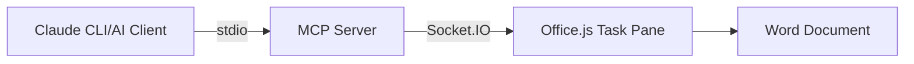

# MCP Word Server

A Model Context Protocol (MCP) server that enables AI-driven document editing workflows with Microsoft Word through Office.js Add-ins.

## Architecture

This server combines two communication protocols:
- **MCP over stdio**: For AI clients (like Claude CLI) to send EditTask commands
- **Socket.IO over HTTP**: For real-time communication with Word Office Add-ins



## Installation

```bash
npm install @modelcontextprotocol/sdk socket.io express
```

## Usage

### 1. Start the MCP Server

```bash
node server.js
```

The server will:
- Start MCP server listening on stdio for AI clients
- Start HTTP server on port 3000 for Office Add-in connections
- Serve static files from the `public/` directory

### 2. Configure MCP Client

For Claude Desktop, add to your MCP configuration:

```json
{
  "mcpServers": {
    "mcp-word": {
      "command": "node",
      "args": ["/workspaces/mcp_word/server.js"],
      "cwd": "/workspaces/mcp_word"
    }
  }
}
```

For Claude CLI:
```bash
claude mcp add mcp_word -- node /workspaces/mcp_word/server.js
```

### 3. Install Office Add-in

1. Open Microsoft Word
2. Navigate to the Add-ins section
3. Sideload the manifest from `public/manifest.xml`
4. The add-in will connect to `http://localhost:3000`

### 4. Send Edit Commands

Use the `EditTask` tool through your MCP client:

```javascript
// Example: Insert text at cursor position
{
  "tool": "EditTask",
  "arguments": {
    "content": "Hello from AI!",
    "action": "insert",
    "position": "cursor"
  }
}
```

## EditTask Tool Parameters

- **content** (required): Text content to insert or edit
- **action** (optional): `"insert"` (default), `"replace"`, or `"append"`
- **position** (optional): `"cursor"` (default), `"start"`, or `"end"`

## Development

### Project Structure
```
/workspaces/mcp_word/
├── server.js          # MCP server with Socket.IO integration
├── public/            # Office Add-in files
│   ├── manifest.xml   # Office Add-in manifest
│   ├── taskpane.html  # Add-in UI
│   └── taskpane.js    # Add-in logic
└── README.md
```

### Environment Variables

- `PORT`: HTTP server port (default: 3000)

### Logging

The server logs to stderr:
- MCP server status and errors
- Socket.IO client connections/disconnections
- EditTask command execution

## Troubleshooting

1. **No Word clients connected**: Ensure the Office Add-in is loaded in Word and can reach `http://localhost:3000`

2. **MCP connection issues**: Verify the MCP client configuration and that `server.js` is executable

3. **CORS errors**: The server allows all origins by default, but firewall settings may block connections

## License

MIT