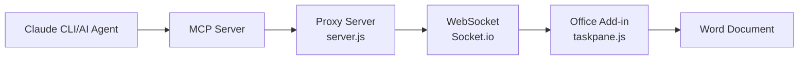

# MCP Word Add-in

A Word Office Add-in using Model Context Protocol (MCP) that enables AI to directly edit Word document content.

## 📋 Table of Contents

- [Features](#features)
- [System Architecture](#system-architecture)
- [Installation & Setup](#installation--setup)
- [Usage](#usage)
- [MCP Tool Documentation](#mcp-tool-documentation)
- [Office Add-in Setup](#office-add-in-setup)
- [API Reference](#api-reference)
- [Troubleshooting](#troubleshooting)
- [Extensibility](#extensibility)

## 🌟 Features

- **AI-Driven Editing**: Enables AI to directly edit Word documents through MCP protocol
- **Real-time Sync**: Uses WebSocket for real-time document updates
- **Easy Integration**: Supports Claude CLI and other AI tools
- **Flexible Operations**: Supports insert, replace, append and other editing operations

## 🏗️ System Architecture



### Core Components

1. **MCP Server**: Main service that handles AI editing requests
2. **Proxy Server**: Provides static file serving and WebSocket communication
3. **Office Add-in**: Client that performs actual editing operations in Word

## 🚀 Installation & Setup

### System Requirements

- Node.js 16+ 
- Microsoft Word (Desktop or Web version)
- Claude CLI or MCP-compatible AI tools

### 1. Install Dependencies

```bash
cd /workspaces/mcp_word
npm install
```

### 2. Start the Server

```bash
# Start MCP and Proxy servers
npm start

# Or run directly
node server.js
```

Server will start at `http://localhost:3000`

### 3. Configure MCP Client

Add this server to your MCP configuration file:

```json
{
  "mcpServers": {
    "mcp-word": {
      "command": "node",
      "args": ["/workspaces/mcp_word/server.js"],
      "env": {
        "PORT": "3000"
      }
    }
  }
}
```

## 📖 Usage

### Basic Workflow

1. **Start the Server**
   ```bash
   npm start
   ```

2. **Load Office Add-in**
   - Open a document in Word
   - Sideload the `manifest.xml` using Word's Add-in loading mechanism
   - The Add-in will automatically establish WebSocket connection

3. **Edit Document via AI**
   ```bash
   # Using Claude CLI
   claude mcp use mcp-word EditTask --content "Hello, World!" --operation "insert"
   ```

### Supported Edit Operations

- `insert`: Insert text at cursor position
- `replace`: Replace selected text
- `append`: Append text at document end

### Supported Position Parameters

- `cursor`: Current cursor position (default)
- `start`: Document start position
- `end`: Document end position

## 🛠️ MCP Tool Documentation

### EditTask Tool

This tool allows AI to edit Word documents through the Office Add-in.

**Parameter Description:**

```typescript
{
  content: string;        // Required: Text content to edit
  operation?: string;     // Optional: Operation type ("insert" | "replace" | "append")
  position?: string;      // Optional: Operation position ("cursor" | "start" | "end")
}
```

**Usage Examples:**

```javascript
// Insert text at cursor position
{
  "content": "This is new paragraph content",
  "operation": "insert",
  "position": "cursor"
}

// Insert title at document start
{
  "content": "# Document Title\n\n",
  "operation": "insert", 
  "position": "start"
}

// Append content at document end
{
  "content": "\n\n---\nEnd",
  "operation": "append"
}
```

## 📁 Office Add-in Setup

### Sideloading the Add-in

1. **Word Desktop Version:**
   - Open Word
   - File → Options → Trust Center → Trust Center Settings → Trusted Add-in Catalogs
   - Add project folder path
   - Restart Word
   - Insert → My Add-ins → Shared Folder

2. **Word Web Version:**
   - Upload manifest.xml to Office 365
   - Or use developer mode to load directly

### manifest.xml Configuration

The Add-in manifest contains these important settings:

```xml
<SourceLocation DefaultValue="http://localhost:3000/taskpane.html"/>
<Permissions>ReadWriteDocument</Permissions>
<Hosts>
  <Host Name="Document"/>
</Hosts>
```

## 📚 API Reference

### WebSocket Events

**Client Listen Events:**
- `ai-cmd`: Receive edit commands from MCP server

**Client Emit Events:**
- `edit-result`: Return edit operation results

### HTTP Endpoints

- `GET /`: Static file serving
- `GET /manifest.xml`: Add-in manifest
- `GET /taskpane.html`: Add-in user interface
- `GET /taskpane.js`: Add-in main logic

## 🔧 Troubleshooting

### Common Issues

**1. Add-in Cannot Load**
- Check if server is running properly on port 3000
- Verify SourceLocation in manifest.xml is correct
- Check Word trust settings

**2. WebSocket Connection Failed**
- Ensure firewall settings allow port 3000
- Check browser console for error messages
- Try reloading the Add-in

**3. MCP Commands Not Responding**
- Confirm Add-in is successfully connected (check server logs)
- Verify MCP client configuration is correct
- Validate command parameter format

### Debug Mode

Enable verbose logging:

```bash
DEBUG=mcp-word* node server.js
```

## 🚀 Extensibility

### Support More Edit Types

The EditTask tool can be extended to support:

- **Formatting Operations**: Bold, italic, underline
- **Table Operations**: Insert and edit tables
- **Image Operations**: Insert images and charts
- **Style Application**: Heading styles, paragraph styles

### Add Authentication and Security

- WebSocket authentication mechanism
- Edit permission control
- Operation history tracking

### Performance Optimization

- Batch operation support
- Connection pool management
- Error retry mechanism

## 📄 License

MIT License - See LICENSE file for details

## 🤝 Contributing

Pull Requests and Issues are welcome to improve this project.

---

**Project Version:** 1.0.0  
**Last Updated:** 2025-01-08
# MCP Word Add-in

一個使用 Model Context Protocol (MCP) 的 Word Office Add-in，讓 AI 能夠直接編輯 Word 文件內容。

## 📋 目錄

- [功能特色](#功能特色)
- [系統架構](#系統架構)
- [安裝設定](#安裝設定)
- [使用方法](#使用方法)
- [MCP 工具說明](#mcp-工具說明)
- [Office Add-in 設定](#office-add-in-設定)
- [API 參考](#api-參考)
- [疑難排解](#疑難排解)
- [擴展功能](#擴展功能)

## 🌟 功能特色

- **AI 驅動編輯**：透過 MCP 協議讓 AI 直接編輯 Word 文件
- **即時同步**：使用 WebSocket 實現即時文件更新
- **簡單整合**：支援 Claude CLI 和其他 AI 工具
- **靈活操作**：支援插入、替換、追加等多種編輯操作

## 🏗️ 系統架構


### 核心元件

1. **MCP Server**：處理 AI 編輯請求的主要服務
2. **Proxy Server**：提供靜態文件服務和 WebSocket 通訊
3. **Office Add-in**：在 Word 中執行實際編輯操作的客戶端

## 🚀 安裝設定

### 系統需求

- Node.js 16+ 
- Microsoft Word (Desktop 版本或 Web 版本)
- Claude CLI 或支援 MCP 的 AI 工具

### 1. 安裝依賴

```bash
cd /workspaces/mcp_word
npm install
```

### 2. 啟動伺服器

```bash
# 啟動 MCP 和 Proxy 伺服器
npm start

# 或直接執行
node server.js
```

伺服器將在 `http://localhost:3000` 啟動

### 3. 設定 MCP 客戶端

在您的 MCP 設定檔中加入此伺服器：

```json
{
  "mcpServers": {
    "mcp-word": {
      "command": "node",
      "args": ["/workspaces/mcp_word/server.js"],
      "env": {
        "PORT": "3000"
      }
    }
  }
}
```

## 📖 使用方法

### 基本工作流程

1. **啟動伺服器**
   ```bash
   npm start
   ```

2. **載入 Office Add-in**
   - 在 Word 中開啟文件
   - 使用側載方式載入 `manifest.xml`
   - Add-in 會自動建立 WebSocket 連線

3. **透過 AI 編輯文件**
   ```bash
   # 使用 Claude CLI
   claude mcp use mcp-word EditTask --content "Hello, World!" --operation "insert"
   ```

### 支援的編輯操作

- `insert`：在游標位置插入文字
- `replace`：替換選取的文字
- `append`：在文件末尾追加文字

### 支援的位置參數

- `cursor`：當前游標位置（預設）
- `start`：文件開始位置
- `end`：文件結束位置

## 🛠️ MCP 工具說明

### EditTask 工具

此工具允許 AI 透過 Office Add-in 編輯 Word 文件。

**參數說明：**

```typescript
{
  content: string;        // 必填：要編輯的文字內容
  operation?: string;     // 選填：操作類型 ("insert" | "replace" | "append")
  position?: string;      // 選填：操作位置 ("cursor" | "start" | "end")
}
```

**使用範例：**

```javascript
// 在游標位置插入文字
{
  "content": "這是新的段落內容",
  "operation": "insert",
  "position": "cursor"
}

// 在文件開始處插入標題
{
  "content": "# 文件標題\n\n",
  "operation": "insert", 
  "position": "start"
}

// 在文件末尾追加內容
{
  "content": "\n\n---\n結束",
  "operation": "append"
}
```

## 📁 Office Add-in 設定

### 側載 Add-in

1. **Word Desktop 版本：**
   - 開啟 Word
   - 檔案 → 選項 → 信任中心 → 信任中心設定 → 受信任的 Add-in 目錄
   - 加入專案資料夾路徑
   - 重新啟動 Word
   - 插入 → 我的 Add-in → 共用資料夾

2. **Word Web 版本：**
   - 上傳 manifest.xml 到 Office 365
   - 或使用開發者模式直接載入

### manifest.xml 設定

Add-in 資訊清單包含以下重要設定：

```xml
<SourceLocation DefaultValue="http://localhost:3000/taskpane.html"/>
<Permissions>ReadWriteDocument</Permissions>
<Hosts>
  <Host Name="Document"/>
</Hosts>
```

## 📚 API 參考

### WebSocket 事件

**客戶端監聽事件：**
- `ai-cmd`：接收來自 MCP server 的編輯指令

**客戶端發送事件：**
- `edit-result`：回傳編輯操作結果

### HTTP 端點

- `GET /`：靜態文件服務
- `GET /manifest.xml`：Add-in 資訊清單
- `GET /taskpane.html`：Add-in 使用者介面
- `GET /taskpane.js`：Add-in 主要邏輯

## 🔧 疑難排解

### 常見問題

**1. Add-in 無法載入**
- 檢查伺服器是否正常運行在 port 3000
- 確認 manifest.xml 中的 SourceLocation 正確
- 檢查 Word 的信任設定

**2. WebSocket 連線失敗**
- 確認防火牆設定允許 port 3000
- 檢查瀏覽器控制台是否有錯誤訊息
- 嘗試重新載入 Add-in

**3. MCP 指令無回應**
- 確認 Add-in 已成功連線（檢查伺服器日誌）
- 檢查 MCP 客戶端設定是否正確
- 驗證指令參數格式

### 偵錯模式

啟用詳細日誌：

```bash
DEBUG=mcp-word* node server.js
```

## 🚀 擴展功能

### 支援更多編輯類型

可以擴展 EditTask 工具以支援：

- **格式化操作**：粗體、斜體、底線
- **表格操作**：插入和編輯表格
- **圖片操作**：插入圖片和圖表
- **樣式應用**：標題樣式、段落樣式

### 增加驗證和安全性

- WebSocket 驗證機制
- 編輯權限控制
- 操作歷史記錄

### 效能優化

- 批次操作支援
- 連線池管理
- 錯誤重試機制

## 📄 授權條款

MIT License - 詳見 LICENSE 文件

## 🤝 貢獻指南

歡迎提交 Pull Request 或建立 Issue 來改善此專案。

---

**專案版本：** 1.0.0  
**最後更新：** 2025-01-08
