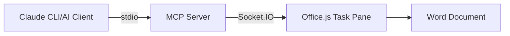

# MCP Word Server

A Model Context Protocol (MCP) server that enables AI-driven document editing workflows with Microsoft Word through Office.js Add-ins.

## Architecture

This server combines two communication protocols:
- **MCP over stdio**: For AI clients (like Claude CLI) to send EditTask commands
- **Socket.IO over HTTPS**: For real-time communication with Word Office Add-ins



## Installation

```bash
npm install @modelcontextprotocol/sdk socket.io express
```

## Usage

### 1. Start the MCP Server (HTTPS only)

```bash
node server.js --key path/to/key.pem --cert path/to/cert.pem --port 3000
```

The server will:
- Start MCP server listening on stdio for AI clients
- Start HTTPS server on port 3000 for Office Add-in connections
- Serve static files from the `public/` directory

### 2. Configure MCP Client

For Claude Desktop, add to your MCP configuration:

```json
{
  "mcpServers": {
    "mcp-word": {
      "command": "node",
      "args": ["/workspaces/mcp_word/server.js"],
      "cwd": "/workspaces/mcp_word"
    }
  }
}
```

For Claude CLI:
```bash
claude mcp add mcp_word -- node /workspaces/mcp_word/server.js
```

Or using a PFX/P12 bundle:

```bash
node server.js --pfx path/to/cert.pfx --passphrase "your-passphrase" --port 3000
```

Notes:
- You will need a certificate trusted by your OS/Office. For local dev, add a self-signed cert to the trust store or use a dev CA.
- The server logs will show `https://localhost:3000` and Socket.IO will connect securely.

### Generate Local TLS Certificate (dev)

Use OpenSSL to create a localhost certificate:

```bash
# 1) Generate self-signed PEM key and cert with SAN for localhost
openssl req -x509 -newkey rsa:2048 -sha256 -days 365 -nodes \
  -keyout key.pem -out cert.pem \
  -subj "/CN=localhost" \
  -addext "subjectAltName=DNS:localhost,IP:127.0.0.1"

# 2) (Optional) Create a PFX/P12 bundle
openssl pkcs12 -export -out cert.pfx -inkey key.pem -in cert.pem -passout pass:your-passphrase

# 3) Start the server with the generated certs
node server.js --key key.pem --cert cert.pem --port 3000
# or
node server.js --pfx cert.pfx --passphrase "your-passphrase" --port 3000
```

Trust the certificate so Office/your browser accepts it:
- macOS: open `cert.pem` in Keychain Access, add to `login` or `System`, set “Always Trust”.
- Windows: import `cert.pem` (or `cert.pfx`) into “Trusted Root Certification Authorities”.
- Linux: trust via your distro/browser store (varies by environment).

### 3. Install Office Add-in

1. Open Microsoft Word
2. Navigate to the Add-ins section
3. Sideload the manifest: `public/manifest.xml` (uses HTTPS by default; adjust host/port if changed)
4. The add-in connects to your HTTPS server origin

### 4. Send Edit Commands

Use the `EditTask` tool through your MCP client:

```javascript
// Example: Insert text at cursor position
{
  "tool": "EditTask",
  "arguments": {
    "content": "Hello from AI!",
    "action": "insert",
    "position": "cursor"
  }
}
```

## EditTask Tool Parameters

- **content** (required): Text content to insert or edit
- **action** (optional): `"insert"` (default), `"replace"`, or `"append"`
- **position** (optional): `"cursor"` (default), `"start"`, or `"end"`

## Development

### Project Structure
```
/workspaces/mcp_word/
├── server.js          # MCP server with Socket.IO integration
├── public/            # Office Add-in files
│   ├── manifest.xml   # Office Add-in manifest
│   ├── taskpane.html  # Add-in UI
│   └── taskpane.js    # Add-in logic
└── README.md
```

### Environment Variables

- `PORT`: HTTPS server port (default: 3000)

### Logging

The server logs to stderr:
- MCP server status and errors
- Socket.IO client connections/disconnections
- EditTask command execution

## Troubleshooting

1. **No Word clients connected**: Ensure the Office Add-in is loaded in Word and can reach `https://localhost:3000`

2. **MCP connection issues**: Verify the MCP client configuration and that `server.js` is executable

3. **CORS errors**: The server allows all origins by default, but firewall settings may block connections

## License

MIT
