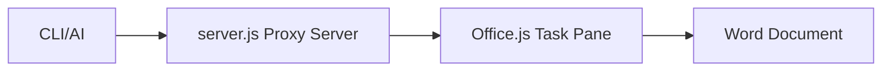

# MCP Word Add-in

A Model Context Protocol (MCP) server that enables AI-driven document editing workflows in Microsoft Word through a proxy server and Office.js Add-in.

## Overview

This project consists of:
- **MCP Server**: Node.js proxy server that implements MCP protocol and serves the Word Add-in
- **Office Add-in**: Client-side application that runs in Word's task pane and applies AI-generated edits



## Features

- Real-time document editing through AI commands
- WebSocket-based communication between server and Add-in
- MCP protocol compliance for integration with AI tools
- Office.js integration for seamless Word document manipulation

## Prerequisites

- Node.js 18+ 
- Microsoft Word (Desktop or Online)
- Claude CLI or compatible MCP client

## Installation

1. Clone the repository:
```bash
git clone <repository-url>
cd mcp_word
```

2. Install dependencies:
```bash
npm install
```

3. Start the MCP Server:
```bash
npm start
```

The server will start on `http://localhost:3000` by default.

4. Configure Claude MCP client:

Add the MCP server to Claude using HTTP transport:

```bash
# Add the Word Editor MCP server
claude mcp add word-editor \
  --transport http \
  socket "http://localhost:3000/mcp"

# Verify the server was added
claude mcp list
```

For custom port configuration:

```bash
# If running server on different port
PORT=4000 npm start

# Then configure Claude with custom URL
claude mcp add word-editor \
  --transport http \
  socket "http://localhost:4000/mcp"
```

## Usage

### 1. Sideload the Word Add-in

#### For Word Desktop:
1. Open Word
2. Go to Insert > My Add-ins > Upload My Add-in
3. Select the `public/manifest.xml` file
4. The Add-in will appear in your task pane

#### For Word Online:
1. Open Word Online
2. Go to Insert > Office Add-ins > Upload My Add-in
3. Select the `public/manifest.xml` file

### 2. Connect MCP Client

#### Using Claude MCP commands:

```bash
# Connect to the configured server
claude mcp connect word-editor

# Use the EditTask tool directly
claude mcp call word-editor EditTask \
  --content "Insert a professional summary about AI technology at the beginning of the document."

# Interactive mode with MCP server
claude --mcp word-editor
```

#### Example Claude MCP Commands:

```bash
# Insert text at cursor
claude mcp call word-editor EditTask \
  --content "Add a new paragraph about machine learning applications."

# Replace selected text  
claude mcp call word-editor EditTask \
  --content "Replace the current selection with: Artificial Intelligence is revolutionizing modern business processes."

# Format and style text
claude mcp call word-editor EditTask \
  --content "Make the first paragraph bold and add a professional heading: Executive Summary"
```

#### Remove MCP server configuration:

```bash
# Remove the server configuration
claude mcp remove word-editor
```

### 3. Document Editing

The Add-in will automatically:
- Receive edit commands via WebSocket
- Apply changes to the active Word document
- Handle text insertion, replacement, and formatting

## MCP Server API

### Tools

#### EditTask
Processes document edit requests and forwards them to the Word Add-in.

**Parameters:**
- `content` (string): The text content to insert or edit instructions

**Example:**
```json
{
  "content": "Replace the first paragraph with a professional introduction about machine learning."
}
```

## Development

### Project Structure

```
mcp_word/
├── server.js           # MCP server and Express static server
├── public/
│   ├── manifest.xml    # Office Add-in manifest
│   ├── taskpane.html   # Add-in UI
│   └── taskpane.js     # Add-in logic and WebSocket client
├── package.json
├── SPEC.md            # Technical specification
└── README.md          # This file
```

### Key Components

- **server.js**: Implements MCP protocol using `@modelcontextprotocol/sdk`
- **taskpane.js**: Handles Office.js integration and WebSocket communication
- **manifest.xml**: Defines Add-in metadata and permissions

### Configuration

The server accepts the following environment variables:

- `PORT`: Server port (default: 3000)
- `HOST`: Server host (default: localhost)

### Debugging

1. **Server logs**: Check console output for MCP and WebSocket events
2. **Add-in debugging**: Use browser dev tools in Word (F12)
3. **Office.js errors**: Monitor the task pane console for Office API issues

## Troubleshooting

### Common Issues

**Add-in not loading:**
- Verify the server is running on port 3000
- Check that `manifest.xml` points to the correct URL
- Ensure Word has internet connectivity
**WebSocket connection failed:**- Confirm the server is accessible at `http://localhost:3000`- Check firewall settings- Verify WebSocket support in your environment**MCP client connection issues:**- Ensure the server is running (`npm start`)- Check that the MCP client supports HTTP transport- Verify the server URL is accessible at `http://localhost:3000/mcp`- Verify command syntax and parameters### LogsServer logs will show:- MCP protocol messages- WebSocket connections- Edit command processing- Error details## Extensibility### Adding New Edit TypesExtend the `EditTask` tool to support:- Table manipulation- Image insertion- Advanced formatting- Document structure changes### Enhanced Features- Authentication and authorization- Multi-user collaboration- Edit history and versioning- Custom AI model integration## License[Your License Here]## Contributing1. Fork the repository2. Create a feature branch3. Make your changes4. Test with Word Add-in5. Submit a pull request## SupportFor issues and questions:- Check the troubleshooting section- Review server logs- Test with minimal reproduction cases- Report bugs with detailed environment information